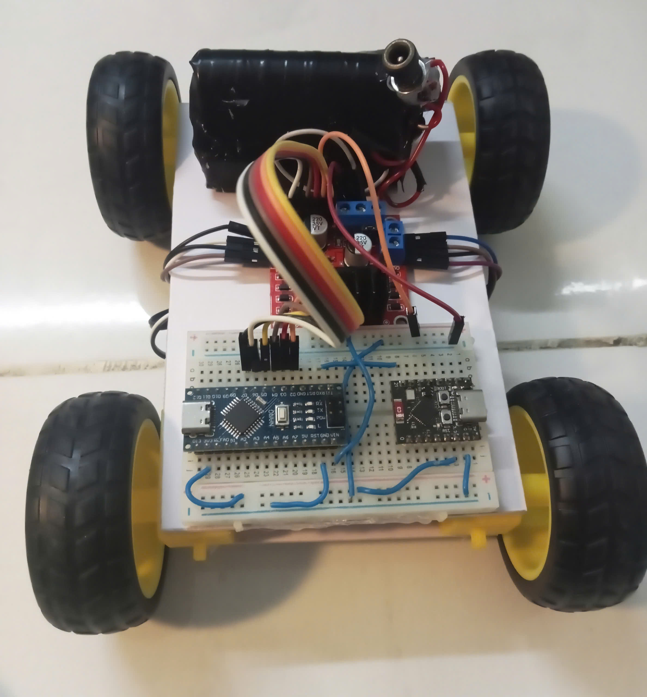

# 🏎️ Web-Controlled RC Car


## 📝 Overview
This repository contains the source code and documentation for a **Web-Controlled RC Car** utilizing a two-board architecture to ensure stable performance:

*   **ESP32 (Wi-Fi Receiver):** Hosts a local asynchronous web server. It is strictly responsible for receiving directional commands from the web interface and forwarding them via one-way Serial (UART) to the Arduino Nano.
*   **Arduino Nano (Motor Controller):** Acts as the main hardware driver. It reads the incoming Serial commands from the ESP32 and directly controls the L298N motor driver using PWM signals.

This separation of tasks ensures that heavy Wi-Fi processing does not interfere with the real-time control of the DC motors.

### 📸 Product Image


### 💻 Web Control Interface


### 🎬 Demo Video
[🎥 Click here to watch the demo video in action](demo.mp4)

---

## ✨ Key Features
*   **Local Wi-Fi Control:** Operates entirely over a local network, requiring no external internet connection.
*   **Responsive Web Dashboard:** Intuitive directional controls built with HTML/JS.
*   **Real-time Execution:** Instantaneous command processing for precise navigation using dual microcontrollers.

## 🛠️ Hardware Requirements
*   1x ESP32 C3 super mini
*   1x Arduino Nano 
*   1x L298N Dual H-Bridge Motor Driver
*   1x 4WD Smart Robot Car Chassis (with 4 DC Motors)
*   Jumper Wires & Power Switch

---

## 🔌 Wiring & Pinout

### 1. Power Routing & Communication
| Source | Destination | Pin Mapping | Function / Description |
| :--- | :--- | :--- | :--- |
| **L298N** | Arduino Nano | 5V ➔ VIN | Power Nano from L298N's built-in 5V regulator |
| **Arduino Nano** | ESP32 | 3.3V ➔ 3.3V | Power ESP32 from Nano's 3.3V output |
| **ESP32** | Arduino Nano | TX ➔ RX | Send Web Server commands to Nano via Serial |
| **All Modules** | All Modules | GND ➔ GND | **Important:** Ensure all components share a Common Ground |

### 2. Motor Control (Arduino Nano to L298N)
| Nano Pin | L298N Pin | Logic Channel | Function |
| :--- | :--- | :--- | :--- |
| **D2** | **IN1** | Channel A | Motor Direction Control |
| **D3** | **IN2** | Channel A | Motor Direction Control |
| **D5** | **ENA** | Channel A | PWM Speed Control |
| **D4** | **IN3** | Channel B | Motor Direction Control |
| **D7** | **IN4** | Channel B | Motor Direction Control |
| **D6** | **ENB** | Channel B | PWM Speed Control |

> ⚠️ **Power Supply Warning:** Always connect your 18650 battery pack directly to the **12V** terminal of the L298N. Do NOT power the motors directly from the microcontroller pins.

---

## 📁 Repository Structure
```text
📦 Web-Controlled-RC-Car
 ┣ 📂 Images
 ┃ ┗ 📜 san_pham.jpg         # Real image of the assembled car
 ┣ 📂 version1.0
 ┃ ┣ 📂 esp32/esp
 ┃ ┃ ┗ 📜 esp.ino            # Source code for ESP32 Web Server
 ┃ ┗ 📂 Nano/nano
 ┃   ┗ 📜 nano.ino           # Source code for Arduino Nano
 ┣ 🎬 demo.mp4               # Video demonstration
 ┗ 📜 README.md              # Project documentation
```
## 🚀 How to Install and Run
### Step 1: Hardware Assembly

* Assemble the 4WD car chassis and attach the motors.
* Connect the motors to the L298N outputs (OUT1 to OUT4).
* Wire the microcontrollers to the L298N according to the Wiring & Pinout tables above.

### Step 2: Software Configuration

* Open the .ino files in the version1.0 folder using Arduino IDE.
* Ensure you have the ESP32 board package installed.
* Update your Wi-Fi credentials in esp.ino:
```text
// File: esp.ino
const char* ssid = "Your_Wi-Fi_SSID";
const char* password = "Your_Wi-Fi_Password";
```

### Step 3: Upload and Control

* Connect the ESP32 and Nano to your computer and upload their respective codes.
* Open the **Serial Monitor** in Arduino IDE (set baud rate to `115200`).
* Press the **EN (Reset)** button on the ESP32.
* Wait a few seconds, the Serial Monitor will display an assigned IP address (e.g., `192.168.1.50`).
* **Access the Web Dashboard:** Open any web browser on your smartphone or PC (ensure it is connected to the same Wi-Fi network) and go directly to:
   👉 `http://<YOUR_ESP32_IP_ADDRESS>`
* The control interface will appear, and you are ready to drive!
## 👨‍💻 Author Information

| Field | Details |
| :--- | :--- |
| **Primary Author** | **Trương Thành Long** |
| **Institution** | **Saigon University** |
| **Email** | truongthanhlong.200806@gmail.com |
| **GitHub** | [@Long-hub-06](https://github.com/Long-hub-06) |
